# SSparseMatrix WL paclet

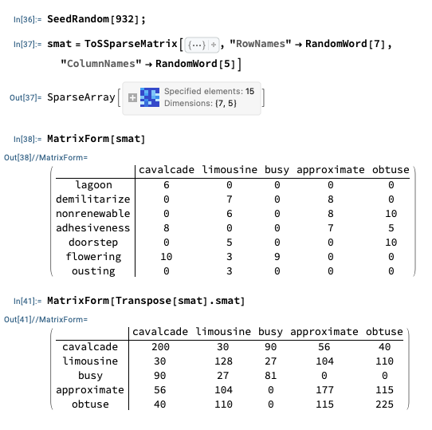

### Basic Description

The paclet provides objects that are sparse matrices with named columns and rows (based on `SparseArray`.)

### Details

Sub-matrix extraction by column- and row names.

Column- and row names propagation for dot products.

Column- and row binding of sparse matrices.

Column- and row  sums.

Tabulation and visualization (of sparse matrices with named rows and columns.)


## Examples

### Basic Examples

Here we create a [SSparseMatrix](https://reference.wolfram.com/language/AntonAntonov/SSparseMatrix/ref/SSparseMatrix) object:

```mathematica
smat = ToSSparseMatrix[
   {{1, 1} -> 1, {2, 2} -> 2, {4, 3} -> 3, {1, 4} -> 4, {3, 5} -> 2}, 
   "ColumnNames" -> {"a", "b", "c", "d", "e"}, 
   "RowNames" -> {"A", "B", "C", "D"}, 
   "DimensionNames" -> {"U", "V"}]
```


The function `MatrixForm`shows the [SSparseMatrix](https://reference.wolfram.com/language/AntonAntonov/SSparseMatrix/ref/SSparseMatrix) objects with their row and column names:

```mathematica
smat // MatrixForm
```

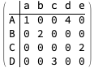

Here we apply `MatrixPlot`:

```mathematica
smat // MatrixPlot
```

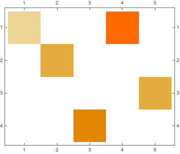

### Scope

#### Query functions

These functions can be used to retrieve the names of rows, columns, and dimensions:

```mathematica
RowNames[smat]

(*{"A", "B", "C", "D"}*)
```

```mathematica
ColumnNames[smat]

(*{"a", "b", "c", "d", "e"}*)
```

```mathematica
DimensionNames[smat]

(*{"U", "V"}*)
```

(They correspond to S's and R's functions rownames, colnames, dimnames.)

Underlying sparse array:

```mathematica
SparseArray[smat]
```


Dimensions:

```mathematica
Dimensions[smat]

(*{4, 5}*)
```

Array rules:

```mathematica
ArrayRules[smat]

(*{{1, 1} -> 1, {1, 4} -> 4, {2, 2} -> 2, {3, 5} -> 2, {4, 3} -> 3, {_, _} -> 0}*)
```

#### Set row names

Here is a copy of the sparse matrix:

```mathematica
smat2 = smat;
MatrixForm[smat2]
```


Here we set different row names:

```mathematica
smat2 = SetRowNames[smat2, ToString /@ Range[RowsCount[smat]]]
```


Matrix form of the result:

```mathematica
MatrixForm[smat2]
```

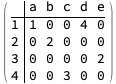

#### Set column names

Here we set different column names:

```mathematica
smat2 = SetColumnNames[smat2, ToString /@ Range[ColumnsCount[smat]]]
```

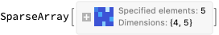

Matrix form of the result:

```mathematica
MatrixForm[smat2]
```


#### Transpose

Here we transpose and show the matrix form:

```mathematica
Transpose[smat] // MatrixForm
```

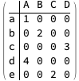

#### Sums

Here is the sum of all elements:

```mathematica
Total[smat, 2]

(*12*)
```

Here are the row sums:

```mathematica
RowSums[smat]

(*{5, 2, 2, 3}*)
```

Here are the column sums:

```mathematica
ColumnSums[smat]

(*{1, 2, 3, 4, 2}*)
```

Here are the row sums as :

```mathematica
RowSumsAssociation[smat]

(*<|"A" -> 5, "B" -> 2, "C" -> 2, "D" -> 3|>*)
```

Here are the column sums as :

```mathematica
ColumnSumsAssociation[smat]

(*<|"a" -> 1, "b" -> 2, "c" -> 3, "d" -> 4, "e" -> 2|>*)
```

#### Dot products

In order to make the 
[`SSparseMatrix`](https://reference.wolfram.com/language/AntonAntonov/SSparseMatrix/ref/SSparseMatrix) 
objects really useful we have to implement matrix-vector and matrix-matrix operations for them. 
(With other 
[SSparseMatrix](https://reference.wolfram.com/language/AntonAntonov/SSparseMatrix/ref/SSparseMatrix) 
objects and with `SparseArray` objects.)

This function is used to visualize the commands, the results, and the results’ heads.

```mathematica
Clear[ResultsGrid]
ResultsGrid[expressions_Inactive, opts___] := 
   Block[{t, t1}, 
    t = Map[HoldForm, expressions, {2}]; 
    t1 = ReleaseHold[Activate[t]]; 
    Grid[MapThread[Prepend, {{Activate[t], MatrixForm /@ t1, Head /@ t1}, Style[#, Blue, FontFamily -> "Times"] & /@ {"expr", "result", "head"}}], opts] 
   ];
```

#### Matrix by vector multiplication

```mathematica
ResultsGrid[Inactive[{smat, Transpose@smat[[{1}, All]], smat . Transpose@smat[[{1}, All]]}], Dividers -> All]
```

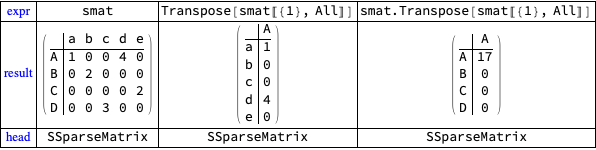

```mathematica
ResultsGrid[Inactive[{smat, smat[[1, All]], smat . smat[[1, All]]}], Dividers -> All]
```

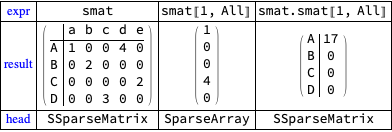

#### Matrix by matrix multiplication

Here is a sparse matrix (2D sparse array):

```mathematica
mat = SparseArray[{{1, 1} -> 1, {2, 2} -> 2, {1, 4} -> 4, {3, 5} -> 2, {4, 3} -> 3}]
```


First we look into a dot product to the right of 
[SSparseMatrix](https://reference.wolfram.com/language/AntonAntonov/SSparseMatrix/ref/SSparseMatrix) 
with a sparse array and a dot product to the left of 
[SSparseMatrix](https://reference.wolfram.com/language/AntonAntonov/SSparseMatrix/ref/SSparseMatrix) 
with a sparse array:

```mathematica
ResultsGrid[Inactive[{smat, mat, smat . Transpose[mat], Transpose[mat] . smat}], Dividers -> All]
```

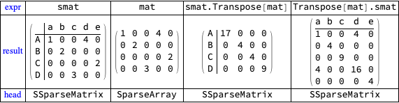

This creates another [SSparseMatrx](https://reference.wolfram.com/language/AntonAntonov/SSparseMatrix/ref/SSparseMatrx) object with no row and column names:

```mathematica
smat2 = ToSSparseMatrix[SparseArray[RandomInteger[{0, 4}, {ColumnsCount[smat], RowsCount[smat]}]]];
```

Next we look into two dot products of two [SSparseMatrx](https://reference.wolfram.com/language/AntonAntonov/SSparseMatrix/ref/SSparseMatrx) objects:

```mathematica
ResultsGrid[Inactive[{smat, smat2, smat . smat2, smat2 . smat, smat . smat2 . smat}], Dividers -> All]
```

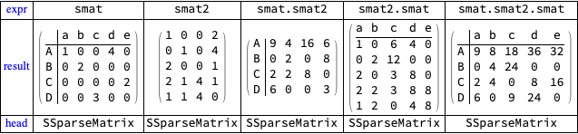

Verification using `SparseArray` objects:

```mathematica
ResultsGrid[Inactive[{SparseArray[smat], SparseArray[rmat2], SparseArray[smat] . SparseArray[rmat2], SparseArray[rmat2] . SparseArray[smat], SparseArray[smat] . SparseArray[rmat2] . SparseArray[smat]}], Dividers -> All]
```

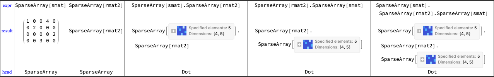

#### Part

A major useful feature is to have `Part` work with row and column names. 
The implementation of that additional functionality for Part is demonstrated below.

In the cases when the dimension drops sparse arrays or numbers are returned. 
In R the operation "[" has the parameter "drop" -- the expression `smat[1,,drop=F]`
is going to be a sparse matrix, the expression `smat[1,,drop=T]` is going to be a dense vector. 
The corresponding implementation is to have the option `Drop -> (False | True)`, 
but that does not seem a good idea.

In the tables with examples below the last rows show the heads of the results.

Single row or column retrieval:

```mathematica
ResultsGrid[Inactive[{smat, smat[["A"]], smat[[All, "a"]], smat[[{"A"}]], smat[["A", All]], smat[[All, "a"]], smat[["A", "d"]]}], Dividers -> All]
```

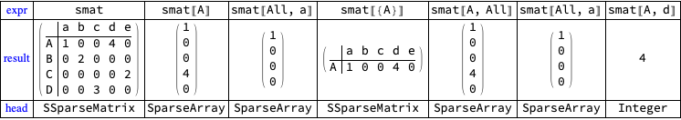

Permutation of both row names and column names:

```mathematica
ResultsGrid[Inactive[{smat, smat[[{"C", "D", "A", "B"}]], smat[[{"C", "D", "A", "B"}, {"c", "d", "e", "a", "b"}]]}], Dividers -> All]
```

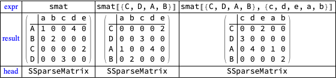

Various subsets:

```mathematica
ResultsGrid[Inactive[
   {smat, smat[[{"A", "B"}, {"a", "c", "d"}]], smat[[2 ;; 3, 1 ;; 2]],smat[[{"A", "B"}, 1 ;; 2]], smat[[All, {"a", "c"}]]}], Dividers -> All]
```

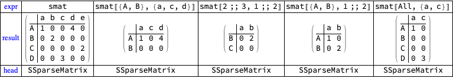

More examples of various subsets:

```mathematica
ResultsGrid[Inactive[
   {smat, smat[[{"A"}, 1]], smat[[{"A"}, {"a"}]], smat[[2, 1 ;; 2]], smat[["C", All]], smat[[All, All]]}], Dividers -> All]
```

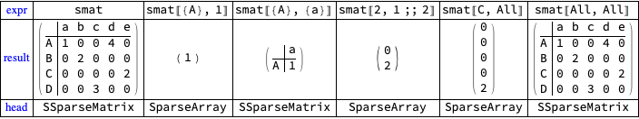

#### Column-binding and row-binding

Row- and column binding are useful in various data analysis scenarios.

When using column and row names there are couple of questions to be answered.

1. How duplication of column (row) names is handled?

2. How can we specify to ignore the column (row) names in the binding process?

```mathematica
smat3 = ToSSparseMatrix[smat, "ColumnNames" -> Map["t." <> # &, ColumnNames[smat]]];
```

```mathematica
smat2 = ToSSparseMatrix[smat, "RowNames" -> Map["s." <> # &, RowNames[smat]]];
```

Here are three matrices:

```mathematica
ResultsGrid[Inactive[{smat, rmat2, smat3}], Dividers -> All]
```

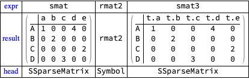

Here are column binding results:

```mathematica
ResultsGrid[Inactive[{ColumnBind[smat, smat2], MatrixForm[ColumnBind[smat, smat3]]}], Dividers -> All]
```

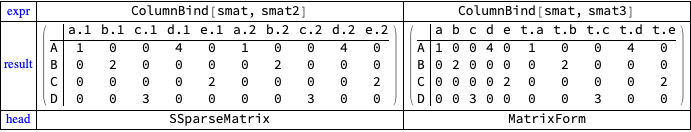

Here are row binding results:

```mathematica
ResultsGrid[Inactive[{RowBind[smat, smat], RowBind[smat, smat2]}], Dividers -> All]
```

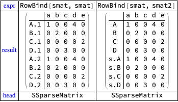

-----

## References

[AA1] Anton Antonov,
["RSparseMatrix for sparse matrices with named rows and columns"](https://mathematicaforprediction.wordpress.com/2015/10/08/rsparsematrix-for-sparse-matrices-with-named-rows-and-columns/),
(2015),
[MathematicaForPrediction at WordPress](https://mathematicaforprediction.wordpress.com).

[AAp1] Anton Antonov,
[SSparseMatrix at PyPI.org](https://pypi.org/project/SSparseMatrix/),
(2021),
[PyPI.org/antononcube](https://pypi.org/user/antononcube/).